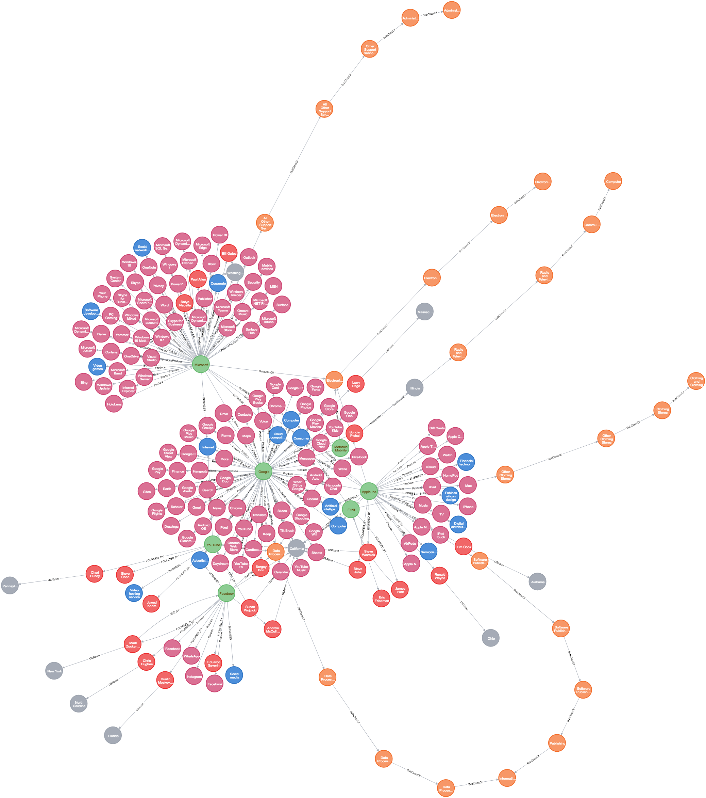

# Google-Info-Database

A graph database contains inforamtion about Googl, Google's competitors and some acquired companies. 


## Manual
#### scrapy: get NAICS code
```
scrapy crawl siccide -t json -o outputfile.json
```
#### Senlenium 
```
python selenium_products.py 
```
#### Neo4j
set up a database for local testing, and placehold the password to be 1234.
#### Jupyter Notebbooks:
Run though the notebooks in order:

- json2neo.ipynb
- json2neo_second_part.ipynb


